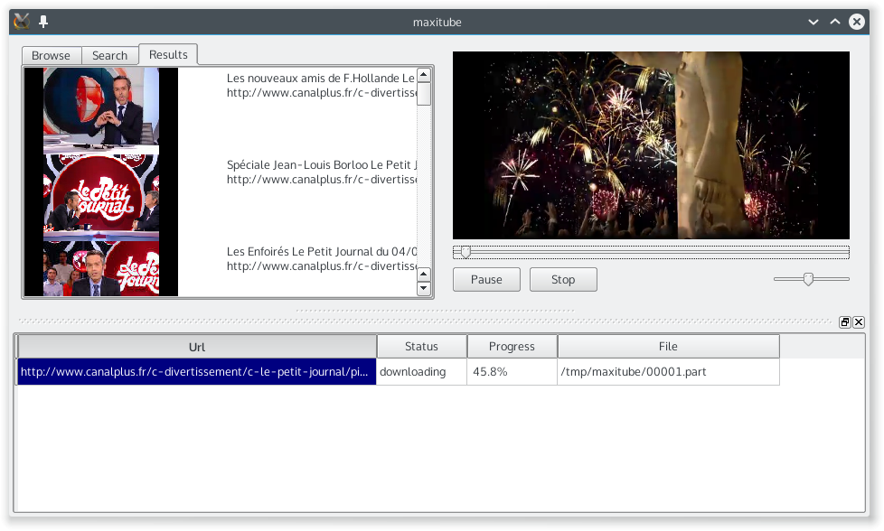

maxitube
========

A GUI to browse/search online videos.
Downloads videos instead of relying on non-free technology such as Adobe Flash and YouTube java player thanks to youtube-dl_.

Supported sites
---------------
* Youtube (https://www.youtube.com/)
* GoldenMoustache (http://www.goldenmoustache.com/)
* Le petit journal (http://www.canalplus.fr/c-divertissement/pid6378-c-le-petit-journal.html)
* Made in Groland (http://www.canalplus.fr/c-divertissement/pid1787-c-groland.html)
* Le Zapping (http://www.canalplus.fr/c-infos-documentaires/pid1830-c-zapping.html)

Run
---
.. code:: bash

    $ python -m maxitube

Installation
------------
.. code:: bash

    # python setup.py install

Dependencies
------------
* Python_ 3.x
* PySide_
* youtube-dl_
* whoosh_ (optional for accurate search results
.. * python-vlc_ (optional for embedded player)

.. _Python: http://www.python.org/
.. _PySide: http://wiki.qt.io/index.php?title=Pyside
.. _youtube-dl: http://rg3.github.io/youtube-dl/
.. _whoosh: https://pythonhosted.org/Whoosh/
.. .. _python-vlc: https://wiki.videolan.org/Python_bindings

License
-------
LGPL
